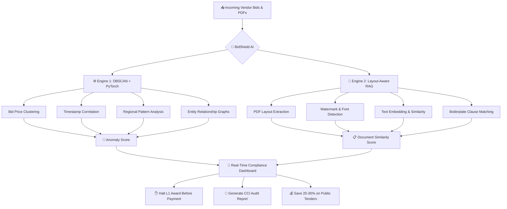

<div align="center">

# 🛡️ BidShield AI — Procurement Cartel Detection System

### Smart India Hackathon 2026 | Team Dev Nexus

*AI-powered real-time fraud detection for government e-procurement portals*

[](https://sih.gov.in)
[](https://python.org)
[](https://react.dev)
[](https://fastapi.tiangolo.com)
[](LICENSE)

</div>

---

## 📌 Problem Statement

India's government e-procurement system processes lakhs of crores in public tenders annually through portals like GeM (Government e-Marketplace), yet it remains deeply vulnerable to **contractor cartels** that systematically rig auctions and siphon public funds. In a fair market, the lowest valid bidder (L1) should win each contract — but in reality, rival contractors form **secret rings** to inflate prices by 20–30%, costing taxpayers thousands of crores every year. These cartels employ four sophisticated fraud techniques: **Cover Bidding** (phantom bids where accomplices intentionally overbid to let the designated winner appear competitive), **Shell Vendor Networks** (a single entity registering multiple fake companies across different VPNs and bank branches to simulate competition), **Copied Proposal Documents** (submitting rephrased or reformatted versions of the same technical PDF across multiple "independent" bids), and **Bid Suppression with Regional Market Allocation** (contractors dividing territories — "you take Maharashtra, I take Gujarat" — and deliberately abstaining from each other's regions). Legacy portal safeguards like IP-address checks, sanction-list matching, and basic document-attachment verification are laughably inadequate against these tactics. Human auditors physically cannot cross-read hundreds of vendor PDFs to catch shared watermarks, and current software evaluates tenders in isolation — completely blind to cross-tender collusion patterns. The result: the government unknowingly awards inflated contracts, the cartel rotates winners month-to-month, and kickbacks flow through fabricated subcontracting arrangements and shadow ledgers. **There is no system in India today that can detect these fraud patterns in real-time before payment is released.**

---

## 💡 Our Solution — BidShield AI

**BidShield AI** is a **Dual-Engine Real-Time Fraud Interceptor** that sits inside the government procurement workflow and catches cartel activity *before* the tender is awarded and *before* money leaves the treasury. Unlike rule-based legacy checks, our system uses a combination of **unsupervised machine learning** and **AI-powered document intelligence** to detect fraud patterns that no human auditor or static ruleset could catch.

**Engine 1 — Statistical Anomaly Detection (DBSCAN + PyTorch):** Our first engine ingests all bid data — prices, timestamps, vendor histories, item-rate breakdowns, and regional patterns — and applies DBSCAN clustering to identify statistically anomalous bid groups. When three vendors submit prices at ₹15Cr, ₹16Cr, and ₹17Cr with suspiciously identical micro-formula structures, or when bids arrive within 30 seconds of each other from "independent" companies, the model flags these as **-1 noise outliers** — the mathematical fingerprint of a cartel. A PyTorch neural network then scores the confidence level and detects rotational winning patterns, regional market splitting, and shell-company networks by analyzing entity relationship graphs.

**Engine 2 — Layout-Aware RAG (Document Intelligence):** Our second engine tackles the PDF problem head-on. Using a **Retrieval-Augmented Generation** pipeline with layout-aware parsing (via libraries like `unstructured`, `PyMuPDF`, and embedding models), the system simultaneously analyzes all vendor proposal PDFs submitted for a tender. It detects copied watermarks, matching font structures, identical boilerplate clauses, shared formatting templates, and rephrased technical sections across documents. When Contractor B's 200-page technical proposal shares the same structural DNA as Contractor A's, BidShield catches it in seconds — not the weeks it would take a human reviewer.

**Real-Time Compliance Dashboard:** Both engines feed into a unified dashboard that generates actionable, evidence-backed fraud reports — complete with mathematical price correlations, highlighted matching PDF pages, entity relationship graphs, and confidence scores. This dashboard can **halt L1 award before payment**, flag suspicious tenders for the Competition Commission of India (CCI), and provide audit-ready evidence packages. The result: **20–30% savings on rigged public tenders**, zero-day pattern detection without hardcoded rules, and a system that gets smarter with every tender it processes.

---

## 🏗️ Project Architecture

```
SIH2026/
├── client/                     # Frontend (React + Vite)
│   ├── public/
│   ├── src/
│   │   ├── components/         # Reusable UI components
│   │   ├── pages/              # Dashboard, Reports, Upload, etc.
│   │   ├── services/           # API client layer
│   │   ├── hooks/              # Custom React hooks
│   │   ├── utils/              # Helper functions
│   │   └── App.jsx
│   ├── package.json
│   └── vite.config.js
│
├── server/                     # Backend (FastAPI + Python)
│   ├── api/                    # Route handlers
│   │   ├── bids.py             # Bid ingestion & analysis endpoints
│   │   ├── documents.py        # PDF upload & comparison endpoints
│   │   ├── reports.py          # Fraud report generation
│   │   └── auth.py             # Authentication
│   ├── core/                   # Business logic
│   │   ├── fraud_engine/       # Engine 1: DBSCAN + PyTorch
│   │   │   ├── clustering.py   # DBSCAN anomaly detection
│   │   │   ├── neural_scorer.py# PyTorch confidence scoring
│   │   │   └── patterns.py     # Rotational/regional pattern detection
│   │   ├── document_engine/    # Engine 2: Layout-Aware RAG
│   │   │   ├── pdf_parser.py   # PDF extraction & layout analysis
│   │   │   ├── embeddings.py   # Document embedding generation
│   │   │   ├── similarity.py   # Cross-document comparison
│   │   │   └── rag_pipeline.py # RAG orchestration
│   │   └── report_generator.py # Compliance report builder
│   ├── models/                 # ML model weights & configs
│   │   └── .gitkeep
│   ├── database/               # Database schemas & migrations
│   ├── config/                 # App configuration
│   ├── tests/                  # Unit & integration tests
│   ├── requirements.txt
│   └── main.py                 # FastAPI entry point
│
├── docs/                       # Project documentation
│   ├── project info.txt
│   └── sample_data/            # Sample PDFs for testing
│
├── .gitignore
├── README.md
└── LICENSE
```

---

## 👥 Team Dev Nexus — Member Roles

| # | Member | Role | Responsibilities | Branch |
|---|--------|------|------------------|--------|
| 1 | **Siddhivinayak Waghmode** | Full-Stack Lead + Document AI | Layout-Aware RAG engine, PDF parser, document similarity pipeline, project setup & architecture | `siddhivinayak-feature` |
| 2 | **Prathamesh** | ML Engineer | DBSCAN clustering, PyTorch neural scorer, bid anomaly detection | `prathamesh-feature` |
| 3 | **Mansi** | ML Engineer + Data | Statistical pattern analysis, entity-relationship graphs, training data pipeline | `mansi-feature` |
| 4 | **Lakshey** | Frontend Lead + Presentation | React dashboard, data visualizations, UI/UX, pitch deck | `lakshey-feature` |
| 5 | **Member 5** | Backend + DevOps | FastAPI endpoints, database, deployment, CI/CD | `member5-feature` |
| 6 | **Member 6** | Research + Testing | Domain research, test data generation, QA, documentation | `member6-feature` |

> **📍 Where is Siddhivinayak?**
>
> Siddhivinayak Waghmode is the **project initiator and Full-Stack Lead**. He is responsible for:
> - Setting up the entire project repository, architecture, and Git workflow
> - Building **Engine 2: Layout-Aware RAG** — the document intelligence pipeline that parses vendor proposal PDFs, extracts layout features (fonts, watermarks, formatting structures), generates embeddings, and detects copied/rephrased proposals across vendors
> - Integrating the PDF comparison results into the compliance dashboard
> - Coordinating between the ML team (Prathamesh & Mansi) and Frontend team (Lakshey)
>
> **Siddhivinayak works in the `siddhivinayak-feature` branch** and merges to `main` via Pull Requests.

---

## 🔧 Tech Stack

| Layer | Technology |
|-------|-----------|
| **Frontend** | React 18, Vite, Chart.js / Recharts, Axios |
| **Backend** | Python 3.11+, FastAPI, Uvicorn |
| **ML Engine 1** | scikit-learn (DBSCAN), PyTorch, NumPy, Pandas |
| **ML Engine 2** | PyMuPDF / pdfplumber, unstructured, sentence-transformers, FAISS |
| **Database** | PostgreSQL + SQLAlchemy (or SQLite for prototype) |
| **Auth** | JWT (python-jose) |
| **Deployment** | Docker, Docker Compose |

---

## 🚀 Getting Started

### Prerequisites
- Python 3.11+
- Node.js 18+ & npm
- Git

### Clone & Setup
```bash
# Clone the repository
git clone https://github.com/siddhivinayak-ai/dev-nexus-sih-2026.git
cd dev-nexus-sih-2026

# Backend setup
cd server
python -m venv .venv
.venv\Scripts\activate        # Windows
pip install -r requirements.txt
uvicorn main:app --reload

# Frontend setup (new terminal)
cd client
npm install
npm run dev
```

### Branch Workflow
```bash
# Each team member works on their own feature branch
git checkout -b siddhivinayak-feature   # Siddhivinayak's branch
git checkout -b prathamesh-feature      # Prathamesh's branch
# ... and so on

# Push your branch
git push -u origin siddhivinayak-feature

# Create Pull Request on GitHub to merge into main
```

---

## 📄 Sample Test Data

To test the fraud detection engines, you'll need sample vendor bid PDFs. Use the following prompt with Claude or any AI to generate realistic test documents:

### Prompt for Generating Sample PDFs

> **Prompt:**
> Generate 3 separate vendor proposal PDF documents for a government tender titled "Supply of 5,000 Desktop Computers to Government Schools — Tender No. GEM/2026/IT/4521". Each PDF should be 3-4 pages and include:
>
> 1. **Company Profile** (different company names: "TechNova Solutions Pvt. Ltd.", "Digital Infra Systems", "CompuWorld Enterprises")
> 2. **Technical Specifications** table for desktop computers (processor, RAM, storage, monitor, warranty)
> 3. **Pricing Breakdown** with item-wise costs and total bid amount
> 4. **Terms & Conditions** section
>
> **CRITICAL — Make these documents exhibit FRAUD patterns:**
> - **PDF 1 (TechNova)** and **PDF 2 (Digital Infra)** should have IDENTICAL formatting, same font usage, same table structures, and the Terms & Conditions section should be copy-pasted with minor word changes (rephrased but same meaning). PDF 2's pricing should be exactly 6% higher than PDF 1 (classic cover bid pattern).
> - **PDF 3 (CompuWorld)** should be genuinely independent — different formatting, different table layout, different T&C wording, and a competitively different pricing structure.
>
> This simulates a cover bidding cartel where TechNova and Digital Infra are colluding, while CompuWorld is a genuine independent bidder. Output each as a clearly separated document with headers marking Document 1, 2, and 3.

---

## 📊 How It Works — Detection Flow



---

## 📅 Development Roadmap

| Phase | Timeline | Deliverables |
|-------|----------|-------------|
| **Phase 1: Foundation** | Week 1 | Project setup, Git workflow, API scaffolding, basic frontend shell |
| **Phase 2: Engine 1** | Week 2-3 | DBSCAN clustering, bid data pipeline, anomaly detection |
| **Phase 3: Engine 2** | Week 2-3 | PDF parser, embeddings, document similarity (Siddhivinayak's core work) |
| **Phase 4: Integration** | Week 4 | Dashboard, report generation, both engines unified |
| **Phase 5: Polish** | Week 5 | Testing with sample data, UI polish, pitch deck, demo prep |

---

## 🤝 Contributing

1. Create your feature branch: `git checkout -b yourname-feature`
2. Commit your changes: `git commit -m "feat: add PDF parser module"`
3. Push to the branch: `git push origin yourname-feature`
4. Open a Pull Request against `main`

### Commit Convention
```
feat:     New feature
fix:      Bug fix
docs:     Documentation changes
style:    Code formatting
refactor: Code restructuring
test:     Adding tests
chore:    Maintenance tasks
```

---

## 📜 License

This project is built for **Smart India Hackathon 2026** by **Team Dev Nexus**.

---

<div align="center">

**Built with ❤️ by Team Dev Nexus for SIH 2026**

*Protecting public funds, one tender at a time.*

</div>
