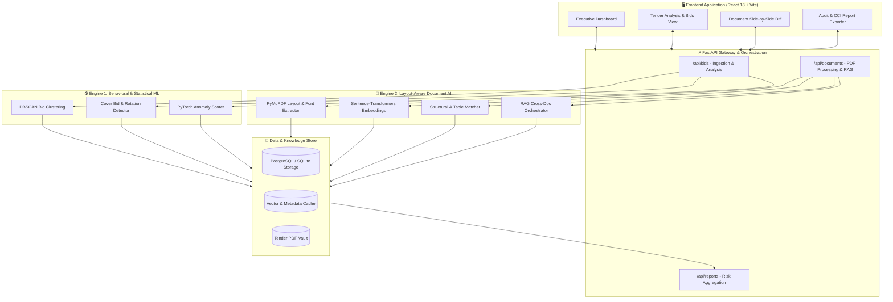

<div align="center">

# 🛡️ BidShield AI — Procurement Cartel Detection System

### Smart India Hackathon 2026 | Team Dev Nexus

*AI-Powered Real-Time Fraud & Collusion Detection for Government e-Procurement Portals*

[](https://sih.gov.in)
[](https://python.org)
[](https://fastapi.tiangolo.com)
[](https://react.dev)
[](https://vitejs.dev)
[](LICENSE)

</div>

---

## 📌 Executive Summary & Problem Statement

India's public e-procurement ecosystem (e.g., GeM, state e-GP portals) processes hundreds of thousands of crores in public tenders annually. Despite procedural guidelines, public procurement remains vulnerable to **organized contractor cartels** that systematically rig bidding rounds and inflate procurement costs by **20% to 30%**.

### Primary Cartel Modus Operandi
1. **Cover Bidding (Phantom Bids):** Colluding bidders submit intentionally inflated or non-compliant bids to create the illusion of competitive bidding, ensuring a predetermined conspirator wins at an inflated price.
2. **Document Forgery & Shared DNA:** Conspirators reuse proposal templates, font systems, table geometries, watermarks, and reworded boilerplate clauses across distinct vendor submissions.
3. **Rotational & Territorial Allocation:** Vendors coordinate across quarters or geographic districts ("you take Region A, I take Region B"), alternating L1 status over time.
4. **Shell Vendor Networks:** A single entity operates several front companies sharing directors, physical addresses, tax identifiers, or identical digital footprints.

Legacy portal checks (basic IP logging, vendor blacklists, and manual file verification) cannot detect cross-tender mathematical anomalies or latent document similarities. **BidShield AI solves this by intercepting fraud in real time before tender finalization and treasury disbursement.**

---

## 💡 System Solution — Dual-Engine Architecture

BidShield AI combines **statistical clustering** with **multimodal document intelligence** to provide a 360° collusion risk index.

```
                     ┌─────────────────────────────────────────────────────────┐
                     │            Incoming Tender & Bid Submissions            │
                     └────────────────────────────┬────────────────────────────┘
                                                  │
                         ┌────────────────────────┴────────────────────────┐
                         ▼                                                 ▼
        ┌──────────────────────────────────┐             ┌──────────────────────────────────┐
        │  ⚙️ ENGINE 1: STATISTICAL ML    │             │  📄 ENGINE 2: LAYOUT-AWARE RAG   │
        │  • DBSCAN Price Anomaly Detector │             │  • PyMuPDF Visual/Layout Parser  │
        │  • Bid Timing & Gap Analysis     │             │  • Sentence-Transformers Embeds  │
        │  • Rotational Network Graphing   │             │  • Font & Table Structural Match │
        │  • PyTorch Confidence Scoring    │             │  • Boilerplate & Watermark Check │
        └────────────────┬─────────────────┘             └────────────────┬─────────────────┘
                         │                                                 │
                         └────────────────────────┬────────────────────────┘
                                                  ▼
                     ┌─────────────────────────────────────────────────────────┐
                     │              Unified Fusion & Risk Scorer               │
                     │  (Aggregates Behavioral Signals + Document Similarity)  │
                     └────────────────────────────┬────────────────────────────┘
                                                  ▼
                     ┌─────────────────────────────────────────────────────────┐
                     │          🛡️ Real-Time Compliance Dashboard             │
                     │  • Instant L1 Hold Triggers    • CCI Audit Evidence Pack│
                     │  • Visual Cartel Clusters      • Side-by-Side PDF Diffs │
                     └─────────────────────────────────────────────────────────┘
```

### 1. Engine 1 — Statistical Anomaly Detection (`DBSCAN` + `PyTorch`)
- **Density-Based Clustering:** Applies DBSCAN across normalized bid values, delta ratios, and submission timestamps to isolate collusive price clusters from authentic market distributions.
- **Pattern Analytics:** Detects cover bidding margins (e.g., constant 5–7% offsets) and multi-tender rotational winning cycles.
- **Entity & Network Graphs:** Maps vendor relationships to expose shared infrastructure, common directors, and regional collusion pacts.

### 2. Engine 2 — Layout-Aware RAG (`PyMuPDF` + `Vector Search`)
- **Structural Layout Extraction:** Extracts font families, font sizes, bounding box coordinates, table schemas, and embedded metadata.
- **Semantic & Clause Matching:** Employs dense vector embeddings (`sentence-transformers`) and cosine similarity matrices to detect reworded technical proposals.
- **Boilerplate & Watermark Fingerprinting:** Flags non-obvious shared formatting DNA and hidden watermarks across distinct vendor PDFs.

---

## 🏛️ System Architecture Diagram



---

## 📁 Repository Structure

```
SIH2026/
├── client/                     # Frontend Web Application (React + Vite + Tailwind/CSS)
│   ├── src/
│   │   ├── components/         # Modular UI elements (Charts, Tables, Alerts)
│   │   ├── pages/              # Dashboard, TenderDetails, ReportGenerator, Landing
│   │   ├── services/           # Axios HTTP API integration layer
│   │   ├── App.jsx             # Route definitions & state container
│   │   └── index.css           # Global design system & theme tokens
│   ├── package.json
│   └── vite.config.js
│
├── server/                     # Backend API & AI Engines (FastAPI + Python 3.11)
│   ├── api/                    # RESTful Endpoints
│   │   ├── bids.py             # Bid data ingestion & statistical scoring
│   │   ├── documents.py        # PDF upload, parsing & pairwise comparison
│   │   └── reports.py          # Fraud summary & audit export routes
│   ├── core/                   # Core Analytical Engines
│   │   ├── fraud_engine/       # Engine 1: Behavioral ML
│   │   │   ├── clustering.py   # DBSCAN clustering implementation
│   │   │   ├── neural_scorer.py# Neural network confidence scoring
│   │   │   └── patterns.py     # Cover bidding & territorial heuristics
│   │   └── document_engine/    # Engine 2: Document Intelligence
│   │       ├── pdf_parser.py   # Layout, font, and table extractor
│   │       ├── embeddings.py   # Vectorization & cosine similarity
│   │       ├── similarity.py   # Cross-document metric fusion
│   │       └── rag_pipeline.py # End-to-end tender document orchestrator
│   ├── database/               # Database models & connections
│   ├── tests/                  # Automated verification test suites
│   ├── docs/sample_data/       # Realistic synthetic PDF test datasets
│   ├── requirements.txt
│   └── main.py                 # FastAPI application root
│
├── docs/                       # Project specifications & research briefs
└── README.md                   # System documentation & setup guide
```

---

## 👥 Team Dev Nexus — Roles & Implementation Status

> *Current Project Progress: **~78% Complete** (Production-ready document intelligence, functional behavioral engine prototypes, interactive dashboard, and integrated test harness).*

| # | Member | Primary Role | Domain Responsibilities | Status & Status | Feature Branch |
|---|---|---|---|:---:|---|

| 1 | **Prathamesh** | ML Engineer (Behavioral Analytics) | • DBSCAN density clustering for bid data<br>• Price-gap anomaly models & boundary tuning<br>• PyTorch confidence classification scoring | "Working" | `prathamesh-feature` |
| 2 | **Mansi** | Data & Graph Analytics | • Cross-tender vendor relationship graph analysis<br>• Rotational win cycle & territorial allocation detection<br>• Synthetic procurement data generation & benchmarking |"Working"| `mansi-feature` |
| 3 | **Lakshey** | Frontend & UI/UX Specialist | • Interactive charts, heatmaps & visual comparison UI<br>• PDF side-by-side diffing components<br>• Presentation deck, system pitch & UX polish |"Working" | `lakshey-feature` |
| 4 | **Siddhivinayak Waghmode** | Full-Stack Lead & Document AI Lead | • Full repo setup, API design & core backend architecture<br>• Engine 2 Layout-Aware RAG (PDF parser, font extractor, table analyzer)<br>• Pairwise similarity pipeline & automated test harness<br>• Frontend integration & interactive dashboard workflows | "Working" | `siddhivinayak-feature` |
| 5 | **Joel** | Backend & Systems Engineer | • FastAPI database persistence layer (PostgreSQL/SQLAlchemy)<br>• Authentication, token management & role-based access<br>• Dockerization, CI/CD pipelines & production deployment | "Working"  | `member5-feature` |
| 6 | **Kunal** | QA, Domain & Legal Research | • CCI regulatory compliance standards & audit format validation<br>• Edge-case test scenario authoring & stress testing<br>• Project documentation & verification reports | "Working" | `member6-feature` |

---

## 🛠️ Technology Stack

| Domain | Technology / Library | Description |
|---|---|---|
| **Frontend** | React 18, Vite, Lucide Icons, Recharts | High-performance interactive compliance portal |
| **Backend API** | FastAPI, Uvicorn, Pydantic | Asynchronous Python REST API gateway |
| **Document AI (Engine 2)** | PyMuPDF (`fitz`), Sentence-Transformers, NumPy | Layout-aware PDF structural & semantic analyzer |
| **Behavioral ML (Engine 1)** | Scikit-learn (DBSCAN), PyTorch, Pandas | Statistical price anomaly & clustering pipeline |
| **Database & Cache** | SQLite / PostgreSQL, SQLAlchemy | Tender registry, vendor profiles & similarity cache |
| **Quality & Testing** | Pytest, Custom Assertion Harness | Automated cross-document cartel verification |

---

## 🚀 Installation & Local Setup

### Prerequisites
- **Python 3.11+**
- **Node.js 18+** & **npm**
- **Git**

### 1. Clone the Repository
```bash
git clone https://github.com/siddhivinayak-ai/dev-nexus-sih-2026.git
cd dev-nexus-sih-2026
```

### 2. Backend Setup
```bash
cd server
python -m venv .venv

# On Windows:
.venv\Scripts\activate
# On Linux/macOS:
# source .venv/bin/activate

pip install -r requirements.txt
uvicorn main:app --reload --port 8000
```
*API Swagger Documentation will be live at `http://localhost:8000/docs`.*

### 3. Frontend Setup
```bash
# In a separate terminal
cd client
npm install
npm run dev
```
*Application UI will be accessible at `http://localhost:5173`.*

### 4. Running Verification Test Suite
```bash
cd server
python tests/test_rag_pipeline.py
```

---

## 🔬 Validation & Sample Datasets

The repository includes synthetic, realistic vendor proposals under `server/docs/sample_data/` specifically curated to benchmark detection engines:
- **`TechNova_Proposal.pdf`**: Primary bidder submission.
- **`DigitalInfra_CoverBid.pdf`**: Cover bidder with structural formatting DNA match, identical font hierarchy, and 6% price inflation.
- **`CompuWorld_Independent.pdf`**: Genuine independent bidder with authentic design, divergent layout, and independent pricing.

Running the automated test suite validates that the cartel ring is detected with high confidence while ensuring zero false positives on authentic bids.

---

## 🤝 Contribution Guidelines

1. Work inside your assigned branch: `git checkout -b <your-name>-feature`
2. Ensure clean formatting and follow PEP 8 for Python / ESLint for React.
3. Verify test runs locally prior to creating a pull request: `python server/tests/test_rag_pipeline.py`
4. Submit PRs against `main` with detailed descriptions of changes.

### Commit Convention
```
feat:     New feature
fix:      Bug fix
docs:     Documentation changes
style:    Code formatting
refactor: Code restructuring
test:     Adding tests
chore:    Maintenance tasks
```

---

## 📜 License

This project is built for **Smart India Hackathon 2026** by **Team Dev Nexus**.

---

<div align="center">

**Built with ❤️ by Team Dev Nexus for SIH 2026**

*Protecting public funds, one tender at a time.*

</div>
